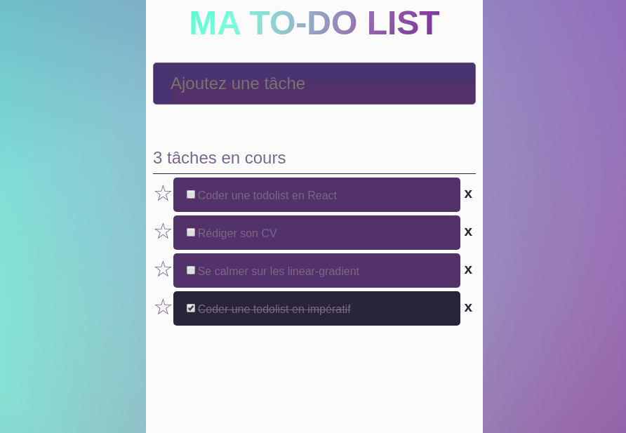

# Todolist en React



## Le but 

Créer une to do list simple pour découvrir React.

## Les fonctionnalités 
* Je peux ajouter une tâche
* Je peux supprimer une tâche 
* Je peux ajouter une tâche en favoris ou l'enlever en cliquant sur l'étoile
* Je peux cocher une tâche comme étant réalisée : elle change de style, devient barrée et n'est plus comptée dans les tâches en cours
* Les tâches sont classées dynamiquement favorites > en cours non favorites > réalisées : le classement changement en fonction du changement d'état

## Comment lancer le projet 
* Clôner 
* ```yarn``` pour installer les dépendances du projet
* ```yarn start``` pour lancer le serveur
* localhost:8080 (ou autre port indiqué par la console)
